# SinhalaUnicodes

SinhalaUnicodes is a Sinhala typing and conversion engine that allows users to type in Singlish (phonetic English letters) and convert text into standard Sinhala Unicode, with real-time support for legacy font output (e.g., *Isiwara*, *Kaputa*, *FM-Abhaya*).

## Live Project & Download

- **Website:** [https://sinhalaunicodes.vercel.app](https://sinhalaunicodes.vercel.app)
- **Desktop EXE Download:** [Google Drive Link](https://drive.google.com/file/d/15ekx8bo5uXdOuZ8T6h4YPwzjyV8S3viO/view?usp=sharing)

---

## Project Overview

This repository contains multiple implementations of Sinhala typing tools:

- A **web-based converter** for instant Singlish-to-Sinhala and legacy font conversion with client-side PDF export.
- A **Windows desktop app** (WinForms on .NET 8) with real-time transliteration, global OS keyboard hooking, and background clipboard monitoring.
- **Legacy project variants** that preserve earlier versions of the keyboard and converter workflows.

---

## Key Features

- **Real-time Singlish to Sinhala Unicode conversion** using a multi-stage phonetic transliteration pipeline.
- **Sinhala legacy font conversion support** with 500+ ordered ligature and Kombuwa substitution rules.
- **Global Keyboard Hooking:** Intercepts keystrokes and hotkeys system-wide via native Win32 APIs and `MouseKeyHook`.
- **Microsoft Office Word / Clipboard Integration:** Real-time clipboard polling to automatically convert text copied from external software.
- **System Tray Daemon Mode:** Minimizes to system tray with context menu controls and Windows startup auto-launch (`HKCU\...\Run`).
- **Client-Side PDF Generation:** Instant export of transliterated text on the web client via `jsPDF`.

---

## Repository Structure

- `/web complete` – Client-side web application (`index.html`, `won.js`, `sinhala-splitter.js`, `app_icon.ico`)
- `/KeyBoard` – Core WinForms desktop project (.NET 8)
- `/Full KeyBoard v1` – Extended desktop application with global hooks, translation manager, toast notifications, and single-file publish profiles
- `/KeyBoard with Legacy` – Desktop variant tailored for legacy font output workflows

---

## Getting Started

### Option 1: Use Online
Open the live site and start typing:
[https://sinhalaunicodes.vercel.app](https://sinhalaunicodes.vercel.app)

### Option 2: Use Desktop EXE
Download the standalone Windows executable:
[Download EXE](https://drive.google.com/file/d/15ekx8bo5uXdOuZ8T6h4YPwzjyV8S3viO/view?usp=sharing)

### Option 3: Run from Source

#### Web version
1. Open `web complete/index.html` in any modern web browser.

#### Desktop version
1. Open `Full KeyBoard v1/KeyBoard.sln` or `KeyBoard/KeyBoard.sln` in Visual Studio 2022+ (with .NET 8 Desktop Workload installed).
2. Build and run the WinForms application.

---

# In-Depth Technical Dossier

### 1. Executive Summary & Architecture
* **Core Functionality:**
  SinhalaUnicodes is a dual-platform (Windows Desktop and Web SPA) phonetic transliteration and font-remapping system. Its primary business logic converts Latin phonetic input (*"Singlish"*) into standard Sinhala Unicode (UTF-16/UTF-8) in real-time, while generating legacy 8-bit ASCII/ANSI font encodings (*Isiwara*, *Kaputa*, *FM-Abhaya*). It enables typing in Sinhala across external Windows software (e.g., Microsoft Word, browsers, graphic design tools) via low-level OS keyboard hooking, system-tray daemon execution, and clipboard integration.

* **Architecture Pattern:**
  - **Desktop Backend:** Event-Driven Client-Side Architecture combined with a Multi-Stage Pipeline/Transformation Chain and Win32 P/Invoke OS Hooks.
  - **Web Frontend:** Lightweight Client-Side Single Page Application (SPA) utilizing an event-driven DOM model and client-side vector document generation.

```mermaid
flowchart TD
    subgraph Desktop [Windows Desktop Client .NET 8 WinForms]
        OSHook[Win32 Low-Level Keyboard Hook / MouseKeyHook] -->|Key Stroke| Form1[Form1 Event Controller]
        Form1 --> CaretMgr[Caret & Word Buffer Manager]
        CaretMgr --> TransMgr[TranslationManager Facade]
        TransMgr --> SinhalaConv[SinhalaConverter Pipeline]
        TransMgr --> LegacyConv[LegacyConverter Rule Engine]
        SinhalaConv -->|Unicode UTF-16| OutputUI[txtOutput / Clipboard]
        LegacyConv -->|Legacy ASCII/ANSI| LegUI[LegOutput / Clipboard]
        ClipTimer[Clipboard Polling Timer] -->|Word Integration| TransMgr
    end

    subgraph Web [Web Client SPA]
        UserInput[textarea #box2 oninput] --> doGnConvert[won.js: doGnConvert]
        doGnConvert -->|Sinhala Unicode| Box3[#box3 Output]
        Box3 --> toisiwara[sinhala-splitter.js: toisiwara]
        toisiwara -->|Legacy Font Output| Box4[#box4 Output]
        Box3 & Box4 --> jsPDF[jsPDF Client Export]
    end
```

* **Component Breakdown:**
  - `SinhalaConverter` / `won.js: doGnConvert`: Multi-stage phonetic transliteration pipeline transforming Latin character sequences into composite Unicode Sinhala glyphs and diacritics.
  - `LegacyConverter` / `sinhala-splitter.js: toisiwara`: Lexical substitution engine containing 500+ ordered replacement rules mapping Sinhala Unicode characters and pre-vowel modifiers (*Kombuwa*) into legacy font codes.
  - `TranslationManager`: Static facade coordinating conversion strategies based on selected UI modes (`Singlish to Sinhala` vs `Singlish to Legacy`).
  - `KeyboardHook`: Unmanaged Win32 API hook manager using `SetWindowsHookEx` (`WH_KEYBOARD_LL`) to intercept OS-level hotkeys globally.
  - `Form1`: Main UI and lifecycle controller managing global key events via `Gma.System.MouseKeyHook`, caret tracking, clipboard polling timer, system tray context menus (`NotifyIcon`), and Windows Registry startup entries.
  - `NotificationForm`: Top-most, borderless toast notification form auto-positioned at screen bounds with an auto-dismiss timer.
  - `ControlExtensions`: Extension utility implementing control-level opacity through alpha-blended parent panel wrapper injection.
  - **Web Client (`index.html`)**: Browser DOM controller providing real-time text transformation, typing guide modal rendering, and `jsPDF` export.

---

### 2. Deep-Dive Tech Stack & Dependencies
* **Core Languages & Runtimes:**
  - **C# 12 / .NET 8.0 Windows Desktop SDK** (`net8.0-windows`).
  - **Target Runtime:** `win-x64` (with x86 and AnyCPU configurations in `KeyBoard.csproj`).
  - **Deployment Profile:** Single-file self-contained deployment (`PublishSingleFile=true`, `SelfContained=true`, `IncludeNativeLibrariesForSelfExtract=true`, `TrimMode=link`).
  - **JavaScript (ES6+) / HTML5 / CSS3** executed directly within browser engines without bundling dependencies.

* **Frameworks & Core Libraries:**
  - **Windows Forms (WinForms):** UI rendering engine for .NET 8 desktop clients (`UseWindowsForms=true`).
  - **`Gma.System.MouseKeyHook` (v5.7.1):** Global mouse and keyboard event interception.
  - **`Microsoft.Office.Interop.Word` (v15.0.4797.1004):** COM Interop assembly for Microsoft Office Word automation.
  - **Native Win32 User/Kernel Libraries:** `user32.dll` and `kernel32.dll` accessed via C# P/Invoke.
  - **`Microsoft.Win32.Registry`:** Windows Registry access for startup persistence.
  - **`jsPDF` (v2.5.1 UMD CDN):** Client-side vector PDF generation in the browser.
  - **`grapheme-splitter` (v1.0.4 CDN):** Unicode grapheme cluster boundary splitter.
  - **`Font Awesome` (v6.5.0 CDN):** Vector iconography.

* **External APIs & Integrations:**
  - **Google Analytics / Google Tag Manager:** Client-side telemetry via `gtag.js` (Property `G-MPGCW0CPZM`) on the web platform.
  - **Windows System Registry:** `HKCU\Software\Microsoft\Windows\CurrentVersion\Run` for auto-boot launch integration.
  - **OS System Clipboard:** Bidirectional OLE clipboard reading and writing via `System.Windows.Forms.Clipboard` and browser `document.execCommand("copy")`.
  - **Hosting / Distribution:** Hosted on **Vercel** (`https://sinhalaunicodes.vercel.app`) with binary distribution via **Google Drive**.

---

### 3. Object-Oriented Programming (OOP) & Design Patterns
* **OOP Principles in Practice:**
  - **Encapsulation:**
    - `SinhalaConverter`: Internal mapping structures (`_gn_c`, `_gn_cUni`, `_gn_v`, `_gn_vUni`, `_gn_vmUni`, `_specialgn_c`, `_specialgn_cUni`, `_gn_sc`, `_gn_scUni`) are marked `private readonly`. They are populated exclusively via private helper methods (`AddVowel`, `AddConsonant`, `AddSpecialCombination`) during construction and exposed to outside callers solely via the public `Convert(string input)` method.
    - `KeyboardHook`: The native Windows hook handle `_hookID` and the low-level callback `HookCallback` are private; external modules interact only with static control methods (`Start()`, `Stop()`) and C# events.
  - **Inheritance & Polymorphism:**
    - `Form1 : Form` and `NotificationForm : Form`: Inherit from `System.Windows.Forms.Form`.
    - Polymorphic override of `SetVisibleCore(bool value)` and `OnFormClosed(FormClosedEventArgs e)` to alter standard WinForms window initialization and intercept form closing to run the app in the background.
  - **Abstraction:**
    - The transformation business logic is completely isolated from the UI: `TranslationManager` and `SinhalaConverter` take raw primitive strings and return transformed strings, completely agnostic of WinForms controls, clipboards, or web DOM elements.
    - Low-level OS keyboard scancodes and virtual keys are abstracted into high-level events (`ToggleWindow`, `ToggleConversionMode`, `CopySinhala`, `CopyLegacy`, `ClearAll`).

* **Design Patterns Used:**
  - **Facade Pattern:** `TranslationManager` acts as a structural facade, providing a unified entry point (`Translate(input, mode)`) that encapsulates the interaction between `SinhalaConverter` and `LegacyConverter`.
  - **Pipeline / Chain of Transformation:** Both `SinhalaConverter.Convert` and `LegacyConverter.ReplaceAll` use a staged transformation pipeline (Special Chars $\to$ Special Combinations $\to$ Rakaransha $\to$ Consonant+Vowel Cross-Product $\to$ Standalone Consonants with Hal-kirima $\to$ Standalone Vowels).
  - **Observer / Event-Driven Pattern:** `KeyboardHook` publishes `EventHandler` events when specific key combinations are pressed; `Form1` subscribes to global events via `IKeyboardMouseEvents`.
  - **Singleton / Static Service Pattern:** `KeyboardHook` and `TranslationManager` are declared as static classes maintaining shared static instances of converters and hook handles across the application lifecycle.
  - **Extension Method Pattern:** `ControlExtensions.Opacity` decorates `System.Windows.Forms.Control` with custom visual opacity behavior.

---

### 4. Data Layer, Security & Tenant Isolation
* **Database & Storage:**
  - **Architecture:** Zero external database (No SQL/NoSQL). All data structures are held entirely **in-memory** within static/instance collections (`List<string>`, `List<Regex>`, arrays).
  - **Persistent Storage:** The only OS-persisted data is the application binary path in the Windows Registry at `HKEY_CURRENT_USER\Software\Microsoft\Windows\CurrentVersion\Run` for auto-start on boot.
  - **Lookup Structures:** In-memory rule mappings are pre-allocated during initialization and indexed during string transformation cycles.

* **Security & Auth:**
  - **Authentication & Authorization:** Not applicable (client-side utility). No network ingress, no API keys, JWT tokens, or multi-tenant database partitions.
  - **Least Privilege OS Integration:** Windows Registry writes in `AddToStartup()` explicitly target `Registry.CurrentUser` (`HKCU`) rather than `Registry.LocalMachine` (`HKLM`), ensuring the application operates without requiring elevated UAC Administrator privileges.
  - **OS-Level Hooking Security Implications:** The use of `SetWindowsHookEx` (`WH_KEYBOARD_LL`) and `GetKeyboardState` operates as a global hook at the Win32 API layer. In production environments, this can trigger heuristic endpoint detection (EDR/Antivirus) alerts; safe handling requires unhooking on application termination via `UnhookWindowsHookEx`.
  - **Web Security (XSS Prevention):** In `index.html: showMapping()`, DOM injection uses `document.createElement("li")` and `.textContent` rather than `.innerHTML` concatenation, preventing Cross-Site Scripting (DOM XSS).

* **Data Flow:**
  - **Desktop Keystroke Transliteration Flow:**
    1. **Ingress:** User types a character in any active Windows application or the WinForms UI.
    2. **Interception:** Win32 `LowLevelKeyboardProc` or `Gma.System.MouseKeyHook` intercepts `WM_KEYDOWN` $\to$ invokes `Form1.OnKeyDown`.
    3. **Virtual Key Translation:** `GetKeyboardState`, `MapVirtualKey`, and `ToUnicode` resolve the virtual key code into a Unicode string character.
    4. **Buffer Mutation:** Character is inserted into `currentWord` buffer at index `caretPosition`.
    5. **Transformation Pipeline:** `UpdateTextBoxWithCaret()` passes `currentWord` to `SinhalaConverter.Convert` $\to$ passes result to `LegacyConverter.toisiwara`.
    6. **Egress / Presentation:** UI text controls (`txtInput`, `txtOutput`, `LegOutput`) are refreshed and scrolled to carets; user can trigger clipboard copy or paste.
  - **Clipboard Monitor Integration Flow:**
    1. `clipboardMonitorTimer` ticks every 500ms $\to$ `ClipboardMonitorTimer_Tick`.
    2. If `isWordIntegrationEnabled` is active and Clipboard contains text: reads `Clipboard.GetText()`.
    3. Executes transliteration and immediately overwrites `Clipboard.SetText(convertedText)`.

---

### 5. Concurrency, Performance & Memory Management
* **Resource Optimization:**
  - **Greedy Longest-Match Sorting:** In `SinhalaConverter.Convert` and `won.js: doGnConvert`, 700+ combined consonant-vowel combinations are sorted in descending order of token length (`combinedPatterns.Sort((x, y) => y.key.Length.CompareTo(x.key.Length))`). This prevents greedy sub-token prefix collisions (e.g., matching `"o"` before `"oo"`, or `"a"` before `"aa"`).
  - **Compiled Regular Expressions:** Special character regexes in `SinhalaConverter` use `RegexOptions.Compiled` to avoid repeated regex compilation overhead across input strokes.
  - **Memory Allocation:** In `SinhalaConverter` and `LegacyConverter`, each keystroke invokes sequential `.Replace()` calls creating new immutable `System.String` allocations on the .NET heap (Gen 0 GC churn), which are quickly reclaimed by the garbage collector.

* **Concurrency Model:**
  - **Single-Threaded Apartment (STA):** `Program.Main` is decorated with `[STAThread]`, which is mandatory for Windows Forms UI rendering, Win32 OLE Clipboard operations, and COM Interop (`Microsoft.Office.Interop.Word`).
  - **Windows Message Pump Dispatching:** Uses `System.Windows.Forms.Timer` for clipboard monitoring (500ms) and notification auto-close (1500ms). These timers dispatch ticks directly on the UI thread's message pump (`WM_TIMER`), avoiding cross-thread UI marshaling (`Control.Invoke`) issues.
  - **P/Invoke Threading:** The Win32 hook callback (`LowLevelKeyboardProc`) executes synchronously within the OS hook chain on the thread that created the hook; hook procedures return promptly via `CallNextHookEx` to avoid OS-level input latency.

---

### 6. Edge Cases, Error Handling & Trade-Offs
* **Resilience & Error Interception:**
  - **Clipboard Access Contention:** In `ClipboardMonitorTimer_Tick`, clipboard read/write calls are wrapped in defensive `try-catch (Exception ex)` blocks to handle Win32 `CLIPBRD_E_CANT_OPEN` errors that occur when external applications lock the Windows clipboard.
  - **Event Recursion Guarding:** In `txtInput_TextChanged`, the handler checks `if (txtInput.Text != currentWord)` before updating `txtInput.Text`, preventing infinite circular `TextChanged` event loops.
  - **Empty/Null Input Guards:** All converter methods (`SinhalaConverter.Convert`, `LegacyConverter.toisiwara`, `won.js: doGnConvert`) begin with `string.IsNullOrEmpty` / falsy checks, gracefully returning empty strings.
  - **External Process Failure Handling:** Web browser launches via `Process.Start` in `supportLinkLabel_Click` are caught with fallback message boxes in case the host machine lacks a default browser association.

* **Technical Trade-Offs:**
  - **Sequential String Replacement vs. Trie / AST State Machine:**
    - *Decision:* Implemented using 500+ sequential string replacements and regex substitutions.
    - *Trade-Off:* Simple to read, debug, and expand with new character mappings without maintaining complex state automata. However, it exhibits $O(N \cdot M)$ computational complexity ($N$ = text length, $M$ = number of rules) and string reallocation overhead compared to an $O(N)$ single-pass Trie or Pushdown Automaton.
  - **Polling Timer vs. Win32 Clipboard Listener API:**
    - *Decision:* Clipboard monitoring for MS Word integration uses a 500ms `Timer` polling loop.
    - *Trade-Off:* Avoids complex Win32 window message hooks (`AddClipboardFormatListener` / `WM_CLIPBOARDUPDATE`), but introduces up to 500ms conversion latency and constant idle CPU polling.
  - **Self-Contained Single-File Binary vs. Framework-Dependent:**
    - *Decision:* Packaged as a self-contained single `.exe` (`PublishSingleFile=true`, `SelfContained=true`).
    - *Trade-Off:* Increases executable file size (~60MB+) due to embedded .NET 8 runtime and native DLLs, but guarantees seamless zero-prerequisite execution on any client machine without requiring pre-installed .NET runtimes.

---

## Contributing

Contributions are welcome. If you want to improve mappings, UI, or platform support, feel free to open an issue or submit a pull request.
